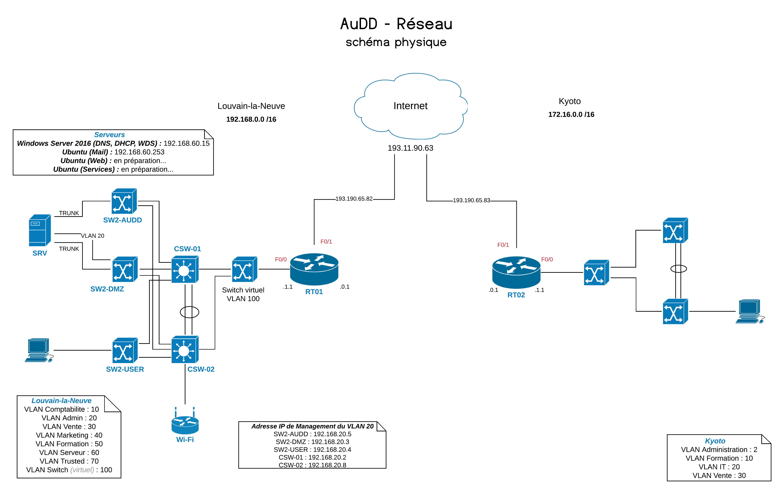
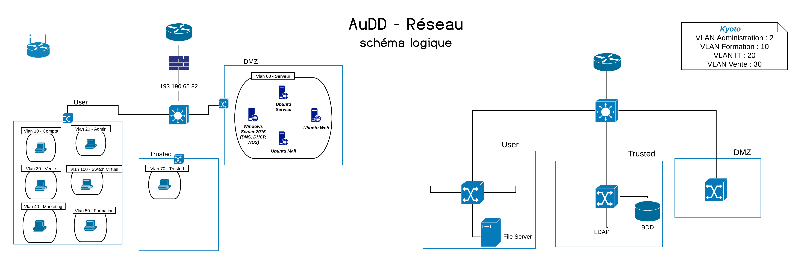

># AuDD
>
>This repository is related to the lesson of Enterprise Network, 3rd Bachelor at EPHEC Louvain-la-Neuve.
>
>It consists of a week-long network security and administration project.

## The project

We represent a team of network and systems administrators of a company that offers training, online.

We must design, install, configure, make accessible and protect the corporate network based on the following statement.
The company is located on a main site in Belgium and has a branch in Kyoto (we have to simulate this, for example, with a PC at the home of one of the students of the group).
It will be necessary to ensure the connection between the two sites and provide for the possibility for the branch to operate independently in the event of loss of connection between the two sites.

The company and its branch have Internet access.
They offer an online training portal and the training calendar is available on a website.
(Note: the main subject of this project is network administration and security and not websites, do not spend "too much" time developing the website and its content).
You have _"carte blanche"_ to take all the initiatives that seem appropriate to you.

## The team

Our team is composed of 20 members and we represent AuDD (IT services), the first of the two groups of this project.

A convention has been written in French and is available [here](doc/AuDD-charte.pdf).

## The repository

* [Documents](doc/): Our convention, logo and teacher files we received.
* [Mail](mail/): All files related for the set up of a mail service.
* [Security](security/): the name says it all ;)
* [Services](services/): same as previous ;)
* [Web](web/): All related files for the showcase website.
* [Reports](report/): All related files about reports, choice of implementations, notes, schemes, a brief daily summary and the timesheet.

## Our network schemes

### Physical network scheme

### Logical network scheme

